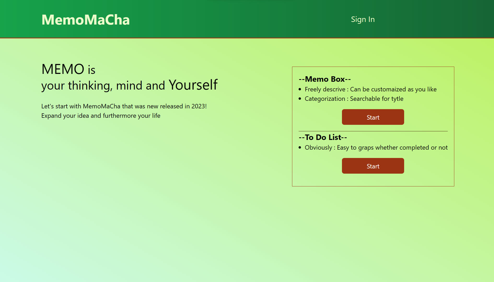

# MemoMaCha

  

<h3 align="center"> <a href="https://arurukun.github.io/Memo_clear_website/"> MeoMaCha </a> </h3>

---

 こちらのイメージ写真をクリックして、お好きなメモやToDoListを作成してみてください！
      

## 🧐 　紹介文 

こちらはオリジナルの Memo 　 Site です。React を用い作成してみました。ユーザー登録後にお好きなようにメモや ToDoList を作成し、尚且つお友達ユーザーを貴方が作ったメモや ToDoList に招待してみてください。招待の方法は２種類あり、Read Only 又は Edit 可能のどちらかを選択してください。すると貴方のお友達もメモや ToDoList の閲覧又は編集が可能となります。さぁ、MemoMaCha を有効に使い、貴方の可能性を広げてみてくださいね！
